# Climbio 2.0

Smart business suite for SMEs in Myanmar. This repository contains a React/Vite client and an Express/Prisma API.

## Gallery

<table>
  <tr>
    <td width="50%">
      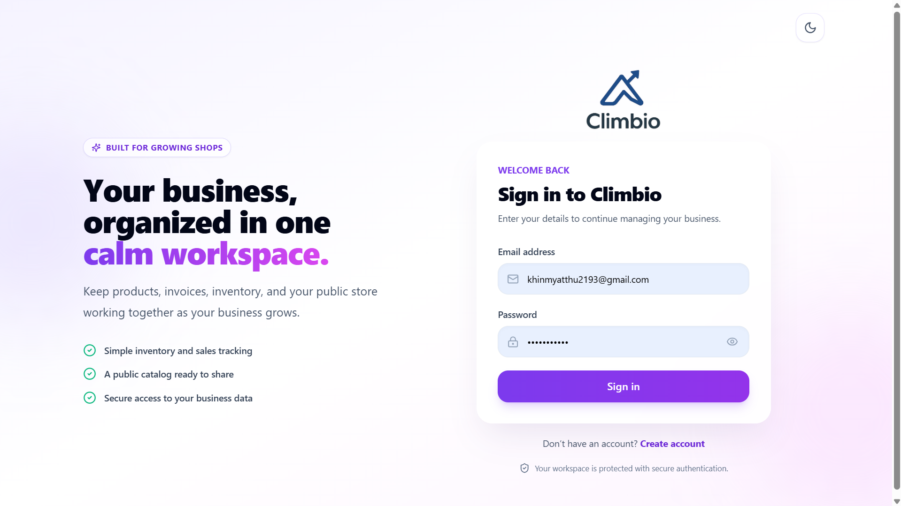
      <strong>Login</strong>
    </td>
    <td width="50%">
      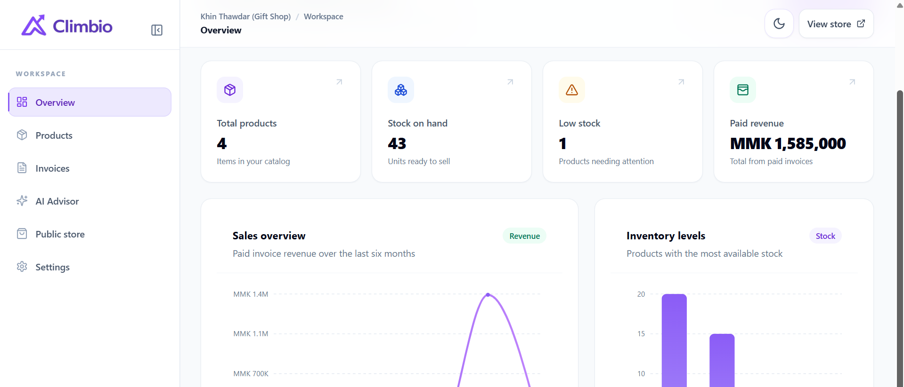
      <strong>Home</strong>
    </td>
  </tr>
  <tr>
    <td width="50%">
      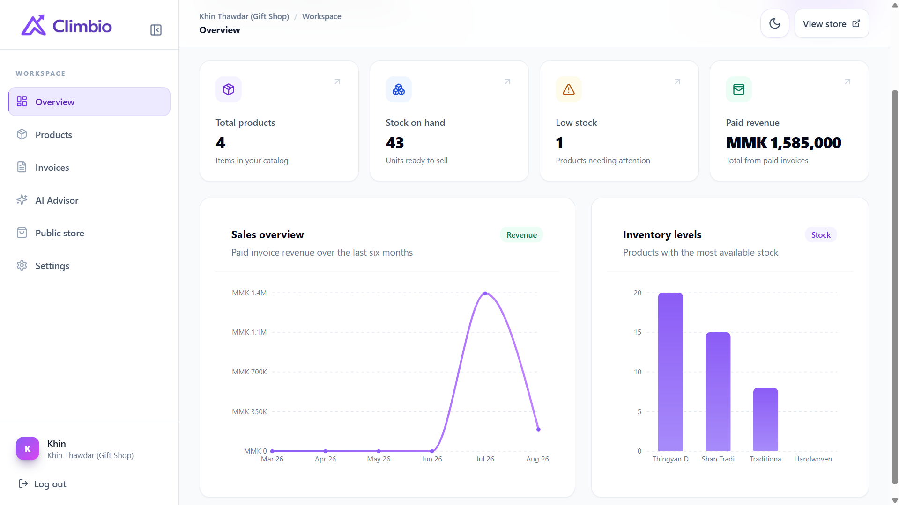
      <strong>Dashboard</strong>
    </td>
    <td width="50%">
      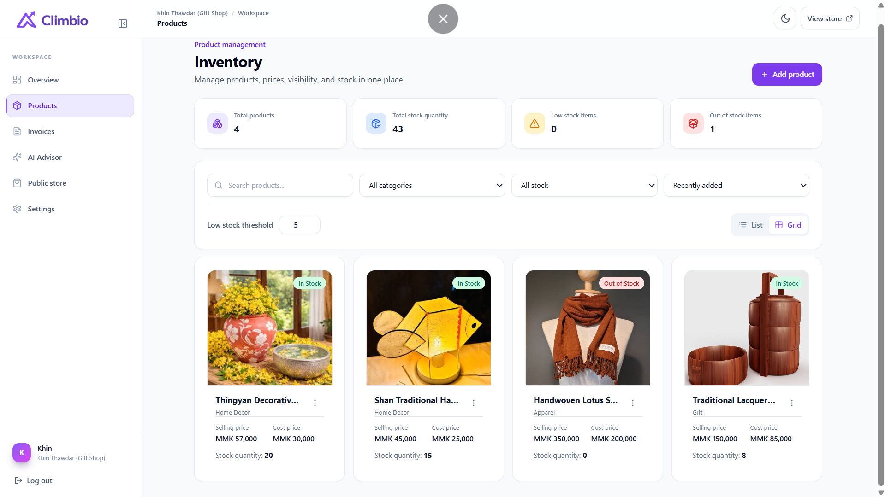
      <strong>Inventory Management</strong>
    </td>
  </tr>
  <tr>
    <td width="50%">
      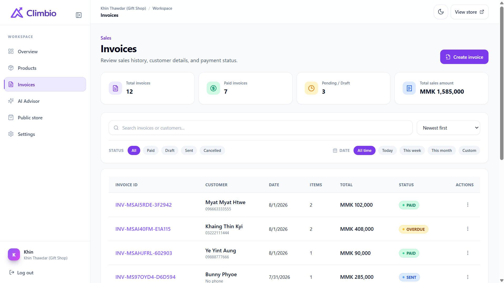
      <strong>Invoice Management</strong>
    </td>
    <td width="50%">
      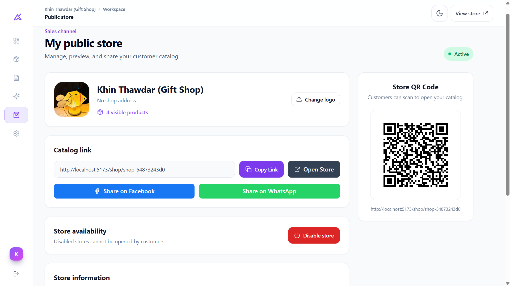
      <strong>Public Store Management</strong>
    </td>
  </tr>
  <tr>
    <td width="50%">
      
      <strong>Customer Store View</strong>
    </td>
    <td width="50%">
      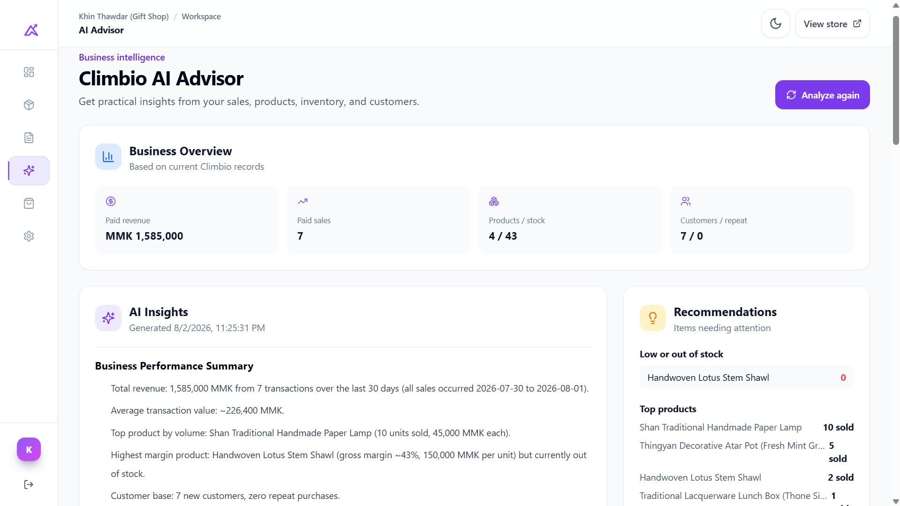
      <strong>AI Advisor Overview</strong>
    </td>
  </tr>
  <tr>
    <td width="50%">
      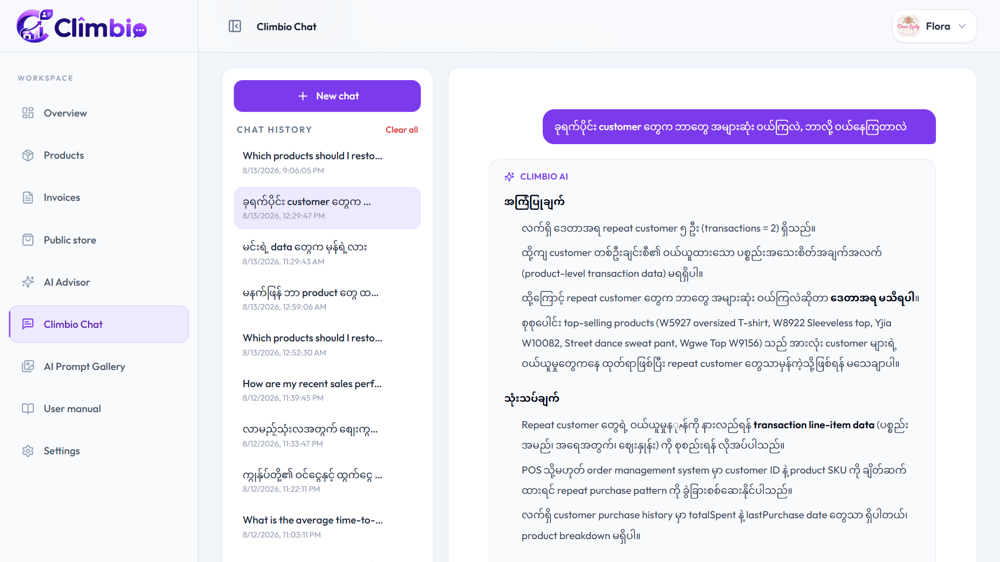
      <strong>AI Business Chatbot</strong>
    </td>
    <td width="50%">
      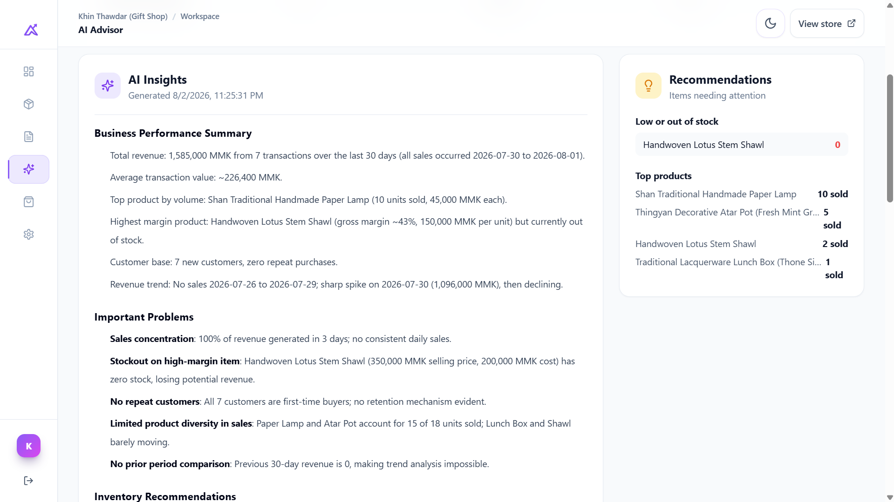
      <strong>AI Recommendations</strong>
    </td>
  </tr>
  <tr>
    <td width="50%">
      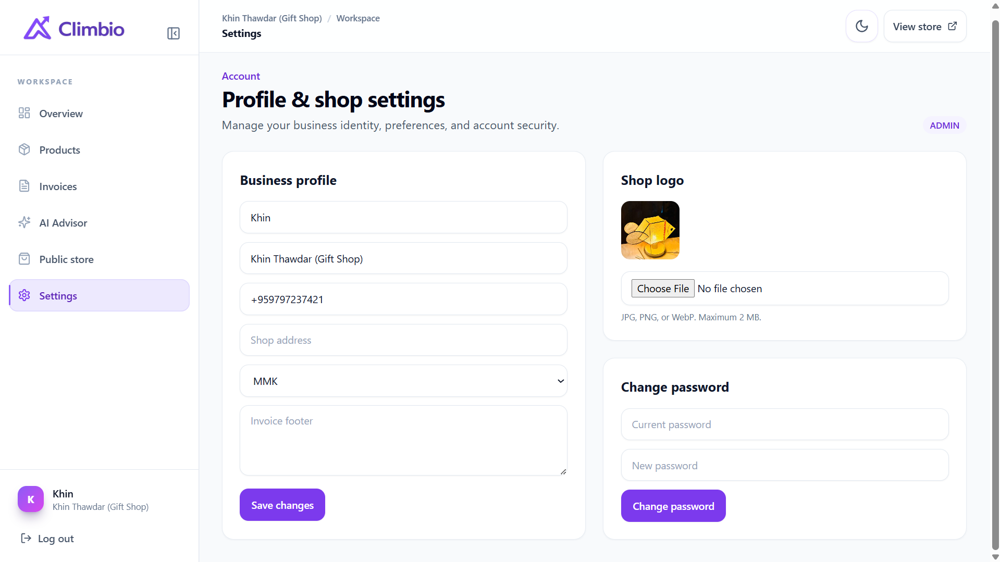
      <strong>Shop Settings</strong>
    </td>
    <td width="50%">
      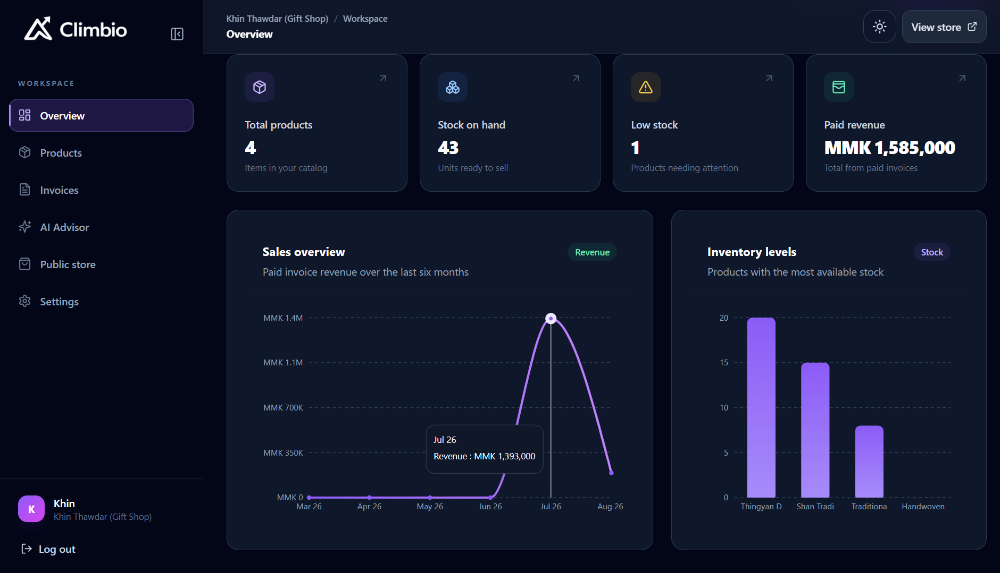
      <strong>Dark Mode</strong>
    </td>
    <td width="50%">
      <strong>Built for SME workflows</strong>
      <p>Inventory, invoices, public storefronts, analytics, and AI guidance in one workspace.</p>
    </td>
  </tr>
</table>

## Overview

Climbio 2.0 helps small business owners manage inventory, invoices, sales performance, and public shop visibility from one secure workspace. It includes a dashboard for business metrics, product and category management, invoice workflows, public storefront pages, and an AI advisor that analyzes real shop data to generate practical recommendations.

## Highlights

- Product, category, stock, pricing, and image management.
- Invoice creation, invoice status tracking, customer details, discounts, and PDF output.
- Sales dashboard with revenue, inventory, low-stock, and chart-based summaries.
- Public storefront pages using shareable shop slugs.
- AI business advisor for sales analysis, inventory recommendations, and action plans.
- Secure authentication with JWT access tokens, rotating refresh tokens, bcrypt password hashing, and role guards.

## Tech Stack

- Frontend: React, TypeScript, Vite, Tailwind CSS, Zustand, TanStack React Query, Recharts.
- Backend: Node.js, Express, TypeScript, Prisma ORM, PostgreSQL.
- Infrastructure: Supabase Storage, Docker, Vercel-ready frontend deployment.

## Prerequisites

- Node.js 20+
- npm 10+
- Docker Desktop (recommended) or PostgreSQL 14+

## Local setup

1. Create local environment files:

   ```powershell
   Copy-Item .env.example .env
   Copy-Item frontend/.env.example frontend/.env
   Copy-Item backend/.env.example backend/.env
   ```

2. Replace both JWT secrets in `backend/.env` with different random values of at least 32 characters.

3. Start PostgreSQL:

   ```powershell
   docker compose up -d postgres
   ```

4. Install dependencies and initialize the database:

   ```powershell
   Set-Location frontend
   npm install
   Set-Location ../backend
   npm install
   npm run prisma:migrate -- --name init
   ```

5. Run `npm run dev` in both `frontend` and `backend`.

The web app runs at `http://localhost:5173`; the API runs at `http://localhost:4000`, with health status at `/health`.

To run the complete development stack in containers, create the three `.env` files and run `docker compose up --build`.

## Authentication

- Access tokens expire after 15 minutes and are kept only in Zustand memory.
- Refresh tokens expire after 7 days, are stored as SHA-256 hashes in PostgreSQL, rotate on use, and travel in an HTTP-only, SameSite cookie.
- Passwords are validated at the API boundary and hashed with bcrypt using 12 rounds.
- `POST /api/auth/register`, `/login`, `/refresh`, and `/logout` implement the session lifecycle.
- `GET /api/auth/me` demonstrates an access-token-protected endpoint.
- `PUT /api/auth/profile` updates profile, address, currency, and invoice settings.
- `PUT /api/auth/change-password` changes the password and revokes active refresh sessions.
- `POST /api/auth/upload-logo` accepts one `logo` image (JPG, PNG, or WebP; maximum 2 MB).
- New accounts receive the `ADMIN` role. Backend and frontend role guards support `ADMIN`, `MANAGER`, and `STAFF`.

## Database

The Prisma schema includes `User`, `Product`, `Category`, `Invoice`, `Customer`, `Setting`, and the supporting `RefreshToken` model. Monetary fields use PostgreSQL `DECIMAL`, invoice items use `JSONB`, image URLs use a PostgreSQL array, and user-owned records have tenant indexes and cascading relations.

Supabase Storage credentials are server-only. Product upload implementation belongs in `backend/src/services/productService.ts`; do not expose the service-role key through a `VITE_` variable.

## Deployment notes

- In Vercel, set `VITE_API_URL` to the deployed backend API URL including `/api` (for example, `https://your-backend.example.com/api`) for Production and Preview, then redeploy so Vite can embed it in the bundle.
- Build the backend with `npm run build`, run `npm run prisma:deploy`, and start with `npm start`.
- On the backend host, set `NODE_ENV=production`, `DATABASE_URL`, `OPENROUTER_API_KEY`, HTTPS `FRONTEND_URL`, strong JWT secrets, and Supabase Storage credentials. `FRONTEND_URL` accepts comma-separated HTTPS origins when both the production and preview frontend must be allowed.
- The PRD mentions both Supabase and Railway for backend hosting. The API is provider-neutral and can run on either; Supabase provides PostgreSQL and Storage.
