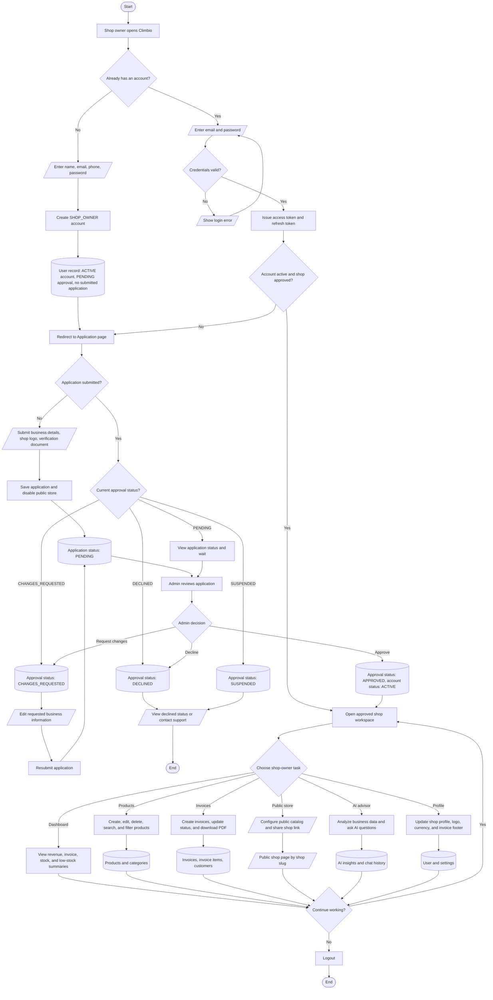

# Climbio v2 Shop Owner Flowchart

This flowchart describes the correct shop-owner journey in the current v2 implementation.

## Symbol Rules

| Symbol | Meaning | Used for |
| --- | --- | --- |
| Rounded terminator | Start / End | Entry and final states |
| Rectangle | Process | User or system action |
| Diamond | Decision | Yes / no or status choice |
| Parallelogram | Input / Output | Forms, uploaded files, public link, PDF |
| Cylinder | Data store | Database records |

## Flowchart

## Notes

- Business modules are blocked until `accountStatus` is `ACTIVE` and `approvalStatus` is `APPROVED`.
- Registration is step 1. The shop application is step 2 and requires business information, a shop logo, and a verification document.
- If changes are requested, the shop owner can edit and resubmit the application.
- If the shop is declined or suspended, the owner cannot access protected business tools.
